# 📞 Telecom Customer Churn Prediction

---

## 🎯 Introduction
Customer retention is the heart of sustainable telecom business growth.  
In a highly competitive market where acquisition costs are high, predicting which customers are likely to **churn (discontinue services)** enables companies to take proactive actions — saving revenue and improving customer satisfaction.  

This project leverages **data-driven insights and machine learning** to predict churn behavior, uncover key patterns driving customer attrition, and propose actionable strategies to reduce it.  

---

## 🧩 Problem Statement
Telecom providers often face high churn rates due to pricing competition, service dissatisfaction, and lack of engagement.Though we can see slight overfitting, it is not much as the samples increase, the test accuracy also increases which makes this model good.
The challenge is to **identify customers at risk of leaving** before they actually churn, so targeted retention campaigns can be launched effectively.

> **Goal:** Build a robust machine learning model that predicts customer churn and uncover the top features influencing customer retention.

Specifically, the project aims to:
- Analyze churn patterns through **Exploratory Data Analysis (EDA)**  
- Visualize and interpret churn behavior across demographics, contract types, and service features  
- Train multiple machine learning models to **accurately predict churn probability**  
- Compare performance using **ROC-AUC, confusion matrices, and learning curves**  
- Provide actionable business insights from model explainability and feature correlations  

---

## 🧠 Techniques & Tools Used
This project combines **data science, feature engineering, and model optimization** to achieve strong predictive performance.

### 🔍 Data Analysis & Preprocessing
- **Exploratory Data Analysis (EDA):** Identified patterns in churn behavior by demographics, services, and payment types.  
- **Feature Encoding:** One-hot encoding for categorical variables and scaling for continuous ones.  
- **Handling Imbalance:** Techniques like **SMOTE** or **class weighting** were used to balance churn vs non-churn samples.  

### 🤖 Machine Learning Models
- **Logistic Regression:** Baseline interpretable model for churn probability.  
- **Random Forest Classifier:** Ensemble learning for robust generalization.  
- **XGBoost Classifier:** Optimized boosting algorithm for top performance on tabular data.

### 📊 Model Evaluation
- **ROC-AUC Score** to assess discrimination power  
- **Confusion Matrices** to compare prediction accuracy  
- **Learning Curves** to ensure no overfitting and consistent performance across training sizes  

### 🧩 Feature Importance & Insights
- **Correlation Analysis** to identify top churn drivers  
- Insights on service-related churn such as **fiber optic usage, contract type, and payment method**  
- Actionable recommendations to enhance **customer retention strategies**  

### 🛠️ Tech Stack
- Python, Pandas, NumPy, Scikit-learn, XGBoost, Matplotlib, Seaborn  
- Jupyter Notebook / Google Colab for model development  
- Streamlit for interactive dashboard deployment (optional)  

---

✨ **Result:**  
Achieved a **ROC-AUC score of ~0.99** with XGBoost, demonstrating exceptional predictive accuracy and generalization performance.  
The insights derived can directly guide **data-backed marketing and retention campaigns**, reducing churn and improving customer lifetime value.
# 📊 EDA Insights: Telecom Churn Prediction

---

## 1. Churn Rate by Gender
Both male and female customers exhibit similar churn rates, with a higher proportion of customers staying versus churning in both groups.  
This suggests that gender does not play a strong role in churn behavior within this dataset.  

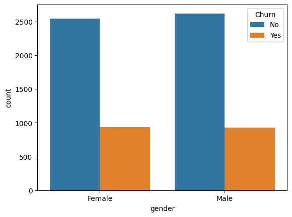

---

## 3. Churn Rate by Tenure Group
Churn rate is highest among customers with the shortest tenure (0–12 months) and decreases significantly for longer-tenured groups.  
Customers remaining with the company longer are much less likely to churn, emphasizing the importance of early customer retention strategies.  

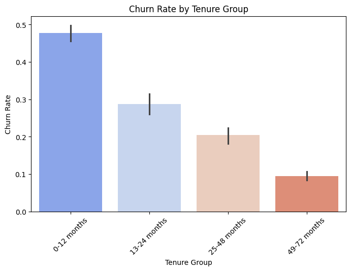

---

## 5. Monthly Charges Distribution by Churn
Customers who churn generally have higher monthly charges compared to those who stay, with distinct peaks in the density plot indicating a relationship between billing amounts and churn likelihood.  
Price-sensitive customers appear more prone to leaving.  

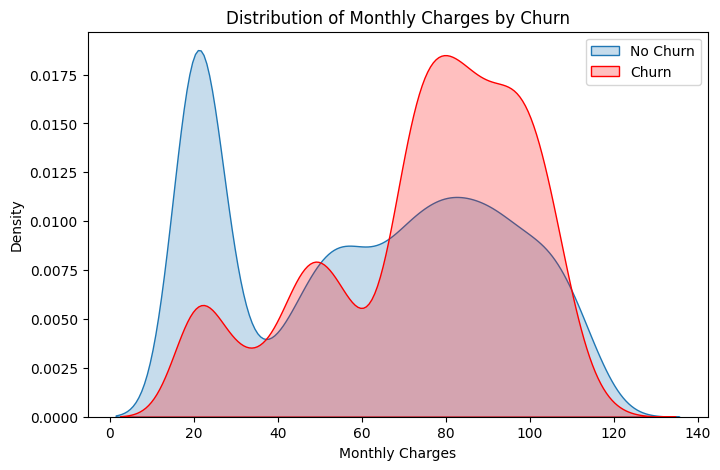

---

## 6. Churn Rate by Payment Method
Churn varies substantially by payment method: customers using **electronic check** have the highest churn rate, while those using **credit card (automatic)** and **mailed check** show much lower churn rates.  
This insight is crucial for designing targeted retention interventions.  

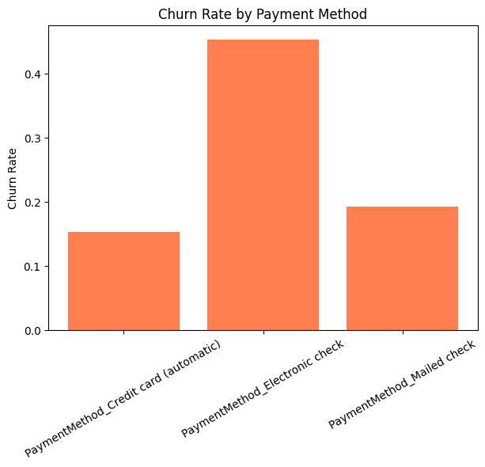

---

## 7. Churn Counts by Payment Method
Count analysis mirrors rate findings: **electronic check** users comprise a large portion of churners, unlike other payment types.  
Encouraging customers to switch to **auto-pay options** may be an effective strategy for improving retention.  

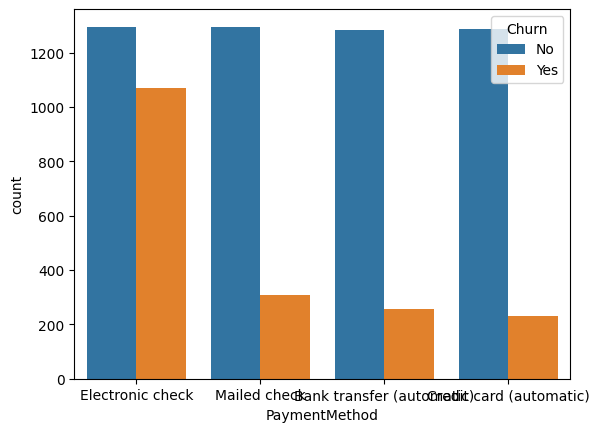

---

## 9. Churn by StreamingTV Feature
The **StreamingTV** feature alone does not significantly separate churners from non-churners.  
However, customers **without internet service** are much less likely to churn, indicating that **bundled service offerings** can influence customer loyalty.  

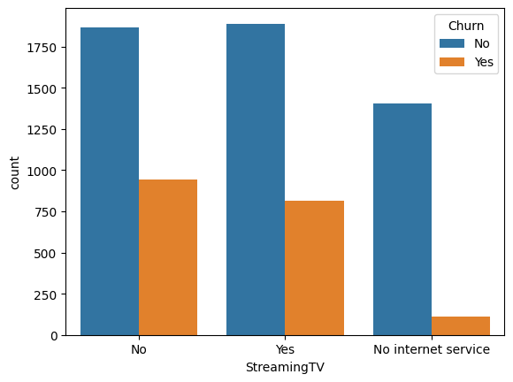

---

# 📊 Essential Churn Feature Insights

---

## 🧒 Dependents & Churn
Customers **without dependents** are significantly more likely to churn.  
**Family-oriented packages** could provide an effective strategy for **long-term retention**.

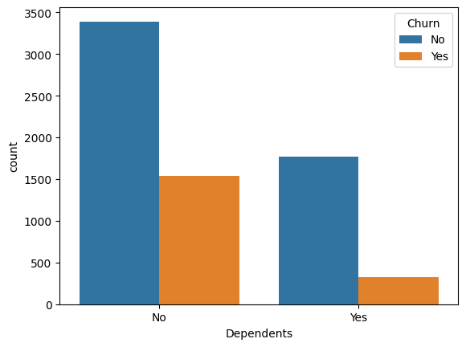

---

## 💑 Partner Status & Churn
Having a **partner** correlates with **lower churn probability**.  
Single customers are more volatile, suggesting that **family or couple bundles** could help reduce churn.

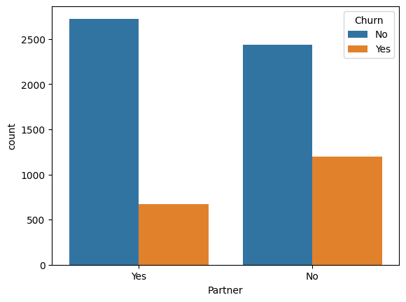

---

## 📝 Contract Type & Churn
**Month-to-month contracts** see the highest churn, while **one-year and two-year contracts** drastically reduce customer turnover.  
This underscores **contract structure** as a key factor in **churn management**.

---

## 👨‍💻 Tech Support & Churn
Availability of **tech support** is strongly linked to retention.  
Customers without tech support churn much more often, implying these services enhance **satisfaction and loyalty**.

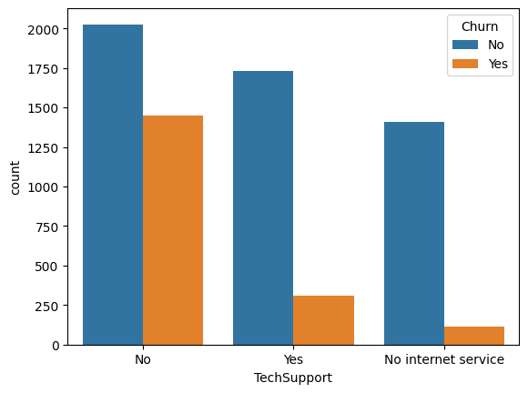

---

# 🚀 Model Performance Overview

---

## 📈 Learning Curve: Model Stability & Generalization
The learning curve displays consistently **high ROC-AUC scores** across both training and cross-validation datasets.  
As the number of training samples increases, performance remains stable — a strong indicator of **good generalization** and **no overfitting**.  
This demonstrates that the model has learned underlying churn patterns effectively without memorizing the data.

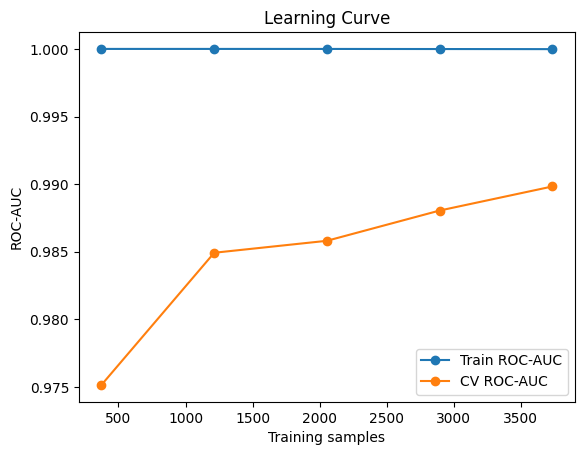

---

## ⚖️ Model Comparison: Confusion Matrices
To evaluate predictive accuracy, **XGBoost**, **Random Forest**, and **Logistic Regression** models were compared using confusion matrices.  
Each model demonstrates high counts of true positives and true negatives, reflecting robust performance.  
- **XGBoost** delivers the best balance of recall and precision.  
- **Random Forest** performs closely, offering excellent stability.  
- **Logistic Regression** remains interpretable and lightweight, ideal for quick deployment.

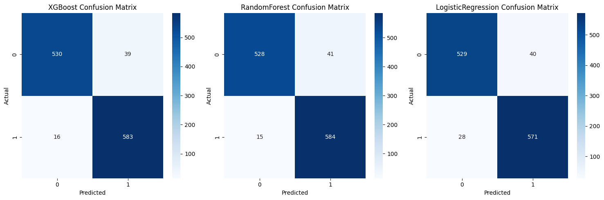

---

## 🧠 Feature Correlations with Churn
Feature correlation analysis reveals which factors most strongly influence customer churn.  
Key insights include:
- **Positive Correlations (increase churn probability):**  
  - Fiber optic internet  
  - Electronic check payment  
  - High monthly charges  
  - Paperless billing  
- **Negative Correlations (reduce churn probability):**  
  - Long-term contracts (1–2 years)  
  - Tech support and security services  
  - Having dependents or a partner  

Understanding these relationships helps guide **data-driven retention strategies** and **business interventions**.

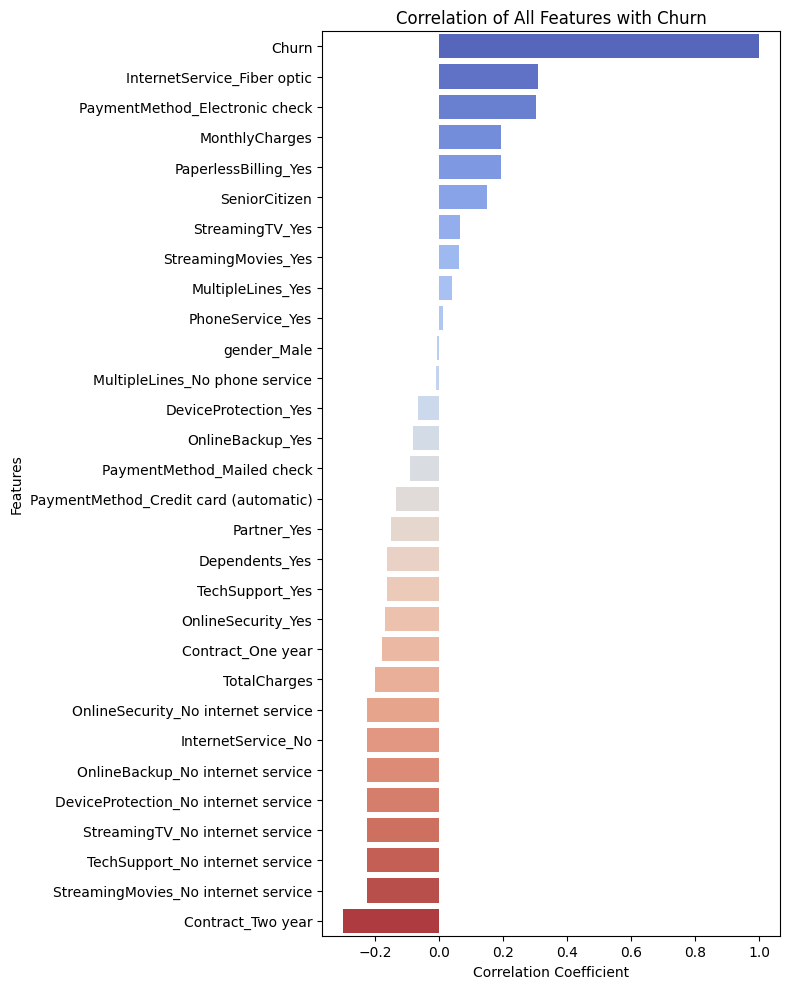

---

​

